# Diagrama do Autômato Finito Determinístico (AFD)

Este documento contém a representação em diagrama do AFD final implementado no analisador léxico (`scanner.c`), preparado para a especificação da linguagem MicroPascal.

Ele pode ser exportado para imagens ou visualizado nativamente em editores compatíveis com Markdow e Mermaid (Ex: VSCode).

```mermaid
stateDiagram-v2
    [*] --> q0
    
    %% Ignorando Lixos Relevantes
    q0 --> q0 : ' ' / \\t / \\n / \\r
    q0 --> q0 : { [Comentário] }
    
    %% Erros Léxicos Direcionais
    q0 --> q_err : [Caractere Inválido / { sem }]
    q_err --> [*] : Aceita ERRO LÉXICO
    
    %% Palavras e Identificadores
    q0 --> q1 : isalpha()
    q1 --> q1 : isalnum()
    q1 --> q2 : Outro
    q2 --> [*] : Aceita KW_... ou ID (ungetc)
    
    %% Numerais (Inteiros e Reais)
    q0 --> q3 : isdigit()
    q3 --> q3 : isdigit()
    q3 --> q4 : Outro
    q4 --> [*] : Aceita NUM_INT (ungetc)
    
    q3 --> q_real_ponto : '.'
    q_real_ponto --> q_real_aceita : isdigit()
    q_real_ponto --> q_err : Outro (ERR_INVALID_REAL)
    q_real_aceita --> q_real_aceita : isdigit()
    q_real_aceita --> [*] : Aceita NUM_REAL (ungetc)
    
    %% Operador Atribuição e Dois Pontos
    q0 --> q5 : ':'
    q5 --> q6 : '='
    q6 --> [*] : Aceita OP_ASS (:=)
    q5 --> q7 : Outro
    q7 --> [*] : Aceita SMB_COL (:) (ungetc)
    
    %% Operadores Relacionais (Maior)
    q0 --> q_maior : '>'
    q_maior --> q_maior_igual : '='
    q_maior_igual --> [*] : Aceita OP_GE (>=)
    q_maior --> q_maior_aceita : Outro
    q_maior_aceita --> [*] : Aceita OP_GT (>) (ungetc)
    
    %% Operadores Relacionais (Menor)
    q0 --> q_menor : '<'
    q_menor --> q_menor_igual : '='
    q_menor_igual --> [*] : Aceita OP_LE (<=)
    q_menor --> q_menor_difr : '>'
    q_menor_difr --> [*] : Aceita OP_NE (<>)
    q_menor --> q_menor_aceita : Outro
    q_menor_aceita --> [*] : Aceita OP_LT (<) (ungetc)
    
    %% Símbolos Diretos
    q0 --> q8 : ';'
    q8 --> [*] : Aceita SMB_SEM (;)
    
    q0 --> q_single : +, -, *, /, =, ., ,, (, )
    q_single --> [*] : OP_AD, OP_MIN, etc
    
    %% Fim
    q0 --> q9 : EOF
    q9 --> [*] : Aceita Fim de Arquivo
```

### Notas sobre o Fluxo
- Componentes como `ungetc` são retrocessores do leitor de cache de arquivos do compilador C. Eles devolvem pontualmente 1 caracter ignorado para voltar a ser consumido pelo `q0` (fundamental na base AFD).
- Todos os `KW` são interpretados dinamicamente no estado de aceitação `q2` (*Case-Insensitive*).
- O diagrama de máquina de estado abarca com precisão todas as chaves e caminhos para identificação 100% de símbolos do MicroPascal.
